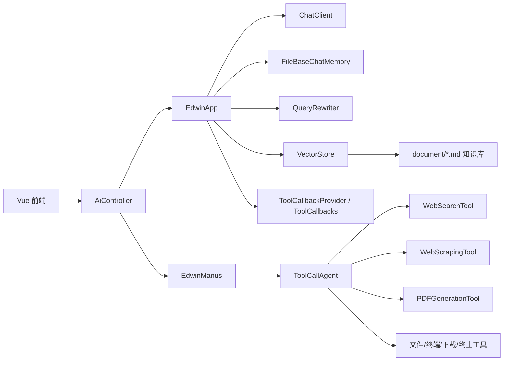

# Edwin AI Agent V2 项目 README

## 1. 项目定位

这是一个前后端分离的 AI Agent 项目，后端基于 Spring Boot 3 + Spring AI + DashScope，前端基于 Vue 3 + Vite + SSE。

项目当前主要提供两类能力：

1. `Edwin App`：偏“聊天应用”模式，支持普通对话、RAG、工具调用、MCP 与 SSE 流式输出。
2. `EdwinManus`：偏“自主代理”模式，支持多步思考、工具调用、搜索验证、结构化状态回传与最终结论输出。

本 README 以当前仓库代码为准，重点回答两件事：

1. 各个文件的职能是什么。
2. 各个模块代码整体在做什么。

说明范围：

- 本文逐项覆盖业务源码、配置、资源、测试和关键工程文件。
- 不逐一展开 `node_modules/`、`target/`、`tmp/`、`.idea/` 这类依赖、缓存、构建产物和 IDE 元数据。

---

## 2. 技术栈

### 后端

- Java 21
- Spring Boot 3.5.9
- Spring Web
- Spring AI
- DashScope / Spring AI Alibaba
- Hutool
- Knife4j / OpenAPI
- Jsoup
- iText PDF
- Kryo

### 前端

- Vue 3
- Vue Router 4
- Axios
- Vite
- EventSource / SSE

---

## 3. 整体架构



可以把项目理解为两条主链路：

- `Edwin App`：更像常规 AI 聊天服务，强调会话、RAG、工具和流式输出。
- `EdwinManus`：更像代理执行器，强调“思考 -> 工具调用 -> 验证 -> 终止”的多步闭环。

---

## 4. 运行方式

### 后端

```bash
./mvnw spring-boot:run
```

默认配置：

- 端口：`8125`
- 上下文路径：`/api`

### 前端

```bash
cd edwin-ai-agent-frontend
npm install
npm run dev
```

默认前端开发端口：

- `5173`

Vite 会把 `/api` 代理到：

- `http://127.0.0.1:8125`

---

## 5. 顶层目录与工程文件职责

| 路径 | 职能 |
| --- | --- |
| `pom.xml` | Maven 工程入口，声明 Java 版本、Spring Boot、Spring AI、DashScope、PDF、搜索与测试依赖。 |
| `mvnw` / `mvnw.cmd` | Maven Wrapper，保证本地无需手工安装 Maven 也能构建项目。 |
| `.mvn/wrapper/maven-wrapper.properties` | Maven Wrapper 的版本与下载配置。 |
| `.gitignore` | 后端工程忽略规则，忽略 `application-local.yml`、`tmp/`、`target/` 等本地产物。 |
| `.gitattributes` | Git 属性配置。 |
| `HELP.md` | Spring Initializr 生成的默认帮助文档，更多是模板残留。 |
| `src/` | 后端源码、资源与测试主目录。 |
| `edwin-ai-agent-frontend/` | Vue 前端工程。 |
| `deleted_files/` | 按仓库规则保留的“历史删除文件归档区”，当前主要保存 LoveApp 更名前的旧文件。 |
| `target/` | Maven 构建产物目录。 |
| `tmp/` | 运行时临时目录，当前被用于聊天记忆、下载文件、PDF 输出和局部 Maven 缓存。 |

---

## 6. 后端模块与文件说明

## 6.1 后端模块作用总览

后端可以按职责拆成 8 个模块：

1. `app`：AI 应用层，对外组织普通聊天、RAG、工具与流式接口。
2. `controller`：HTTP 入口层，把请求转给 `EdwinApp` 或 `EdwinManus`。
3. `agent`：代理执行框架，负责多步推理、工具调用、SSE 状态输出与终止控制。
4. `tools`：代理可调用工具，如网页搜索、网页抓取、PDF 生成、文件读写、终端执行等。
5. `rag`：知识库加载、向量库构建、查询改写、RAG Advisor 组装。
6. `chatmemory`：基于文件的会话记忆实现。
7. `advisor`：Spring AI 调用链增强器，负责日志与提示增强。
8. `config` / `constant`：基础配置与常量。

---

## 6.2 后端核心链路

### A. `Edwin App` 链路

`AiController` -> `EdwinApp` -> `ChatClient` -> 可选 RAG / Tool / MCP / SSE

这条链路适合：

- 普通聊天
- 带会话记忆的聊天
- 带 RAG 的问答
- 工具增强问答
- SSE 流式返回

### B. `EdwinManus` 链路

`AiController` -> `EdwinManus` -> `ToolCallAgent` -> `WebSearchTool` / `WebScrapingTool` / 其他工具 -> SSE 结构化输出

这条链路适合：

- 需要多步执行的任务
- 需要搜索与验证的任务
- 需要代理显式展示“思考过程 / 当前状态 / 最终回复”的任务

---

## 6.3 后端源码文件职责表

### 应用入口与 HTTP 层

| 文件 | 职能 |
| --- | --- |
| `src/main/java/com/edwin/edwin_ai_agent/EdwinAiAgentApplication.java` | Spring Boot 启动入口。 |
| `src/main/java/com/edwin/edwin_ai_agent/controller/AiController.java` | 暴露 `/ai` 下的 HTTP 接口，负责同步聊天、SSE 聊天和 Manus Agent 调用。 |
| `src/main/java/com/edwin/edwin_ai_agent/app/EdwinApp.java` | 后端 AI 应用主服务，统一组织 ChatClient、会话记忆、RAG、工具、MCP 和流式输出。 |

### Advisor 模块

| 文件 | 职能 |
| --- | --- |
| `src/main/java/com/edwin/edwin_ai_agent/advisor/MyLoggerAdvisor.java` | 记录 AI 请求与响应日志，支持普通调用与流式调用。 |
| `src/main/java/com/edwin/edwin_ai_agent/advisor/ReReadingAdvisor.java` | 在用户问题前追加“重新阅读问题”的提示，用于提升模型理解稳定性。 |

### Agent 模块

| 文件 | 职能 |
| --- | --- |
| `src/main/java/com/edwin/edwin_ai_agent/agent/model/AgentState.java` | 定义 Agent 生命周期状态：`IDLE`、`RUNNING`、`FINISHED`、`ERROR`。 |
| `src/main/java/com/edwin/edwin_ai_agent/agent/BaseAgent.java` | Agent 基类，提供状态机、消息历史、最大步数控制、同步执行与 SSE 执行框架。 |
| `src/main/java/com/edwin/edwin_ai_agent/agent/ReActAgent.java` | ReAct 抽象层，把一步执行拆成 `think()` 与 `act()`。 |
| `src/main/java/com/edwin/edwin_ai_agent/agent/ToolCallAgent.java` | 代理核心实现，负责调用模型生成工具计划、执行工具、做防重/预算/证据阈值控制，并把结果转成结构化 SSE 气泡。 |
| `src/main/java/com/edwin/edwin_ai_agent/agent/EdwinManus.java` | 基于 `ToolCallAgent` 的具体代理，定义系统提示词、下一步提示词和最大步数。 |

### Chat Memory / 基础配置

| 文件 | 职能 |
| --- | --- |
| `src/main/java/com/edwin/edwin_ai_agent/chatmemory/FileBaseChatMemory.java` | 用 Kryo 把会话消息序列化到磁盘，实现基于文件的聊天记忆。 |
| `src/main/java/com/edwin/edwin_ai_agent/config/CorsConfig.java` | 全局跨域配置，允许前端本地开发直连后端。 |
| `src/main/java/com/edwin/edwin_ai_agent/constant/FileConstant.java` | 定义运行期文件写入根目录，统一指向 `tmp/`。 |

### RAG 模块

| 文件 | 职能 |
| --- | --- |
| `src/main/java/com/edwin/edwin_ai_agent/rag/LoveAppDocumentLoader.java` | 从 `classpath:document/*.md` 加载 Markdown 文档，并写入元数据。 |
| `src/main/java/com/edwin/edwin_ai_agent/rag/LoveAppVectorStoreConfig.java` | 构建 `SimpleVectorStore`，把知识文档做富化后写入向量库。 |
| `src/main/java/com/edwin/edwin_ai_agent/rag/QueryRewriter.java` | 通过 Spring AI 的 `RewriteQueryTransformer` 对用户问题进行检索前改写。 |
| `src/main/java/com/edwin/edwin_ai_agent/rag/MyKeywordEnricher.java` | 调用模型给文档补关键词元数据，增强召回效果。 |
| `src/main/java/com/edwin/edwin_ai_agent/rag/MyTokenTextSplitter.java` | 提供默认和自定义两种文档分片方式。 |
| `src/main/java/com/edwin/edwin_ai_agent/rag/LoveAppContextualQueryAugmenterFactory.java` | 创建查询增强器，在上下文不足时用额外提示约束模型。 |
| `src/main/java/com/edwin/edwin_ai_agent/rag/LoveAppRagCustomAdvisorFactory.java` | 构造带元数据过滤能力的 RAG Advisor。 |

### Tools 模块

| 文件 | 职能 |
| --- | --- |
| `src/main/java/com/edwin/edwin_ai_agent/tools/ToolRegistration.java` | 把所有工具封装成 `ToolCallback[]`，供 `EdwinApp` 和 `EdwinManus` 注入使用。 |
| `src/main/java/com/edwin/edwin_ai_agent/tools/FileOperationTool.java` | 提供文件读写能力，读写目录在 `tmp/file/`。 |
| `src/main/java/com/edwin/edwin_ai_agent/tools/ResourceDownloadTool.java` | 提供资源下载能力，把远程内容下载到 `tmp/download/`。 |
| `src/main/java/com/edwin/edwin_ai_agent/tools/TerminalOperationTool.java` | 提供终端命令执行能力，本质上调用 `cmd.exe /c`。 |
| `src/main/java/com/edwin/edwin_ai_agent/tools/PDFGenerationTool.java` | 提供结构化 PDF 生成能力，支持标题、摘要、Markdown 内容、表格和图片。 |
| `src/main/java/com/edwin/edwin_ai_agent/tools/WebScrapingTool.java` | 抓取网页正文，抽取标题、摘要、日期线索和核验片段。 |
| `src/main/java/com/edwin/edwin_ai_agent/tools/WebSearchTool.java` | 对接 Tavily 搜索，并实现官方优先、二轮检索、结果重排、页面核验和证据阈值判断。 |
| `src/main/java/com/edwin/edwin_ai_agent/tools/TerminateTool.java` | 供 Agent 显式终止任务，用于结束多步执行。 |

---

## 6.4 后端各模块代码作用详解

### `EdwinApp` 在做什么

`EdwinApp` 是“聊天应用层”的核心封装，内部创建了一个带默认系统提示和文件记忆的 `ChatClient`，并向外提供多种调用方式：

- `doChat`：普通同步对话。
- `doChatWithReport`：要求模型按结构化对象 `LoveReport` 返回。
- `doChatWithRag`：先改写查询，再走向量检索问答。
- `doChatWithTools`：允许模型调用本地注册工具。
- `doChatWithMcp`：允许模型通过 MCP ToolCallbackProvider 调工具。
- `doChatByStream`：以 Flux 流式返回文本。

也就是说，`EdwinApp` 解决的是“如何把聊天、记忆、RAG、工具和流式输出装配到一处”。

### `BaseAgent` / `ReActAgent` / `ToolCallAgent` 在做什么

这一组类构成了代理执行框架：

- `BaseAgent` 负责生命周期、消息历史、最大步数与 SSE 封装。
- `ReActAgent` 规定“一步 = 先想 think，再做 act”。
- `ToolCallAgent` 真正实现工具代理逻辑。

`ToolCallAgent` 里最关键的职责有 5 个：

1. 让模型先输出工具计划。
2. 使用 `ToolCallingManager` 执行工具。
3. 防止重复工具批次和重复搜索词死循环。
4. 给搜索结果做证据阈值判断，避免证据不足时给出“看似精确”的错误答案。
5. 把执行状态组装成结构化 payload，前端可以渲染成 `thought/final/error` 气泡。

这也是整个项目最“Agent 化”的一层。

### `WebSearchTool` 在做什么

`WebSearchTool` 不是简单的“调一下搜索 API”，它实际上实现了一套检索策略层：

1. 识别查询意图：
   - 是否像新闻
   - 是否像活动/日程
   - 是否像金融
   - 是否像机构/官网查询
   - 是否像数据密集型查询
2. 根据意图构造检索参数：
   - 是否优先官方域名
   - 是否需要核验网页
   - 是否需要高级搜索深度
   - 是否应用时间范围
3. 先跑官方轮，再按需跑广泛轮。
4. 对候选结果做重排：
   - 来源权重
   - 关键词匹配
   - 日期线索
   - 页面类型特征
   - 抓取核验结果
5. 根据“是否可直接回答”和“证据是否足够”给出 `evidenceThresholdMet`。

因此，`WebSearchTool` 的作用不是“找结果”，而是“尽量找到可被代理安全引用的结果”。

### `WebScrapingTool` 在做什么

`WebScrapingTool` 的目标不是保留原网页 HTML，而是把网页转成适合代理判断的结构化信息：

- `summary`：可读摘要
- `matchedDateHints`：日期线索
- `verificationSnippet`：核验片段
- `verificationStatus`：是否抓到有效内容、是否带日期、是否抓取失败

这使得 `WebSearchTool` 可以进一步判断结果是不是“真正能支持答案”的页面。

### `PDFGenerationTool` 在做什么

这个工具负责把结构化输入转成正式 PDF。它支持：

- 标题和副标题
- 摘要说明
- Markdown 风格正文
- 表格 JSON
- 图片 JSON
- 中文字体加载

它本质上是一个“可被 Agent 调用的文档产出器”，适合计划书、方案、总结、报告生成。

### `RAG` 模块在做什么

RAG 相关代码主要完成 4 件事：

1. 从 `resources/document/` 读取 Markdown 知识库。
2. 对文档补关键词元数据。
3. 构建 `SimpleVectorStore`。
4. 在用户提问前做查询改写，以提高向量检索召回质量。

当前知识库内容仍沿用 `LoveApp` 命名，但实际已经被 `EdwinApp` 复用。

---

## 7. 资源与配置文件说明

| 文件 | 职能 |
| --- | --- |
| `src/main/resources/application.yml` | 主配置文件，定义项目名、端口、上下文路径、OpenAPI/Knife4j、`tavily.api-key` 占位。 |
| `src/main/resources/application-local.yml` | 本地环境配置，包含 DashScope 与 Tavily Key、端口和上下文路径等。 |
| `src/main/resources/mcp-servers.json` | MCP Server 配置，声明 `edwin_ai_agent_imageSearchMCPServer` 的启动命令。 |
| `src/main/resources/document/恋爱常见问题和回答 - 单身篇.md` | RAG 知识库文档之一。 |
| `src/main/resources/document/恋爱常见问题和回答 - 恋爱篇.md` | RAG 知识库文档之一。 |
| `src/main/resources/document/恋爱常见问题和回答 - 已婚篇.md` | RAG 知识库文档之一。 |
| `src/main/resources/static/fonts/SourceHanSansCN-Regular.otf` | PDF 工具使用的中文正文字体。 |
| `src/main/resources/static/fonts/SourceHanSansCN-Bold.ttf` | PDF 工具使用的中文粗体字体。 |
| `src/main/resources/templates/` | 预留模板目录，目前未见实际业务模板。 |

### 配置模块作用

- `application.yml` 更偏“工程默认值”。
- `application-local.yml` 更偏“本地私有运行配置”。
- `mcp-servers.json` 用于把外部 MCP 工具接进 AI 体系。
- `document/*.md` 是当前 RAG 的知识源。

---

## 8. 前端模块与文件说明

## 8.1 前端模块作用总览

前端只有一个核心页面组件体系，但它被复用成两种界面：

1. `Edwin App` 页面：偏聊天型，要求 `chatId`。
2. `Manus Agent` 页面：偏代理型，不要求 `chatId`。

前端真正的核心不在页面，而在：

- `ChatWorkspace.vue`：通用聊天工作台
- `services/chat.js`：SSE 连接创建
- `utils/streamLifecycle.js`：SSE 消息生命周期解析与打字机控制

---

## 8.2 前端文件职责表

### 工程与入口文件

| 文件 | 职能 |
| --- | --- |
| `edwin-ai-agent-frontend/package.json` | 前端依赖与脚本定义。 |
| `edwin-ai-agent-frontend/package-lock.json` | 前端依赖锁文件。 |
| `edwin-ai-agent-frontend/vite.config.js` | Vite 开发服务器配置与 `/api` 代理配置。 |
| `edwin-ai-agent-frontend/index.html` | Vite HTML 入口。 |
| `edwin-ai-agent-frontend/.gitignore` | 前端忽略规则。 |
| `edwin-ai-agent-frontend/README.md` | 前端子项目说明文档，内容部分仍有旧命名残留。 |

### 前端源码

| 文件 | 职能 |
| --- | --- |
| `edwin-ai-agent-frontend/src/main.js` | Vue 应用启动入口，挂载路由与全局样式。 |
| `edwin-ai-agent-frontend/src/App.vue` | 顶层壳组件，仅承载 `router-view`。 |
| `edwin-ai-agent-frontend/src/styles.css` | 全局基础样式。 |
| `edwin-ai-agent-frontend/src/router/index.js` | 前端路由表，定义首页、`/edwin-app` 与 `/manus`。 |
| `edwin-ai-agent-frontend/src/pages/HomePage.vue` | 首页，展示两个应用卡片入口。 |
| `edwin-ai-agent-frontend/src/pages/LoveChatPage.vue` | `Edwin App` 页面配置壳，传入标题、提示词、接口路径和主题。 |
| `edwin-ai-agent-frontend/src/pages/ManusChatPage.vue` | `Manus Agent` 页面配置壳，传入不同接口路径与主题。 |
| `edwin-ai-agent-frontend/src/components/ChatWorkspace.vue` | 通用聊天工作台，负责消息列表、SSE 接入、结构化气泡渲染、打字机动画、自动滚动与新会话管理。 |
| `edwin-ai-agent-frontend/src/services/http.js` | Axios 基础实例与 API Base URL 解析。 |
| `edwin-ai-agent-frontend/src/services/chat.js` | 构造 SSE 请求地址并创建 `EventSource`。 |
| `edwin-ai-agent-frontend/src/utils/id.js` | 生成会话 ID / 消息 ID。 |
| `edwin-ai-agent-frontend/src/utils/streamLifecycle.js` | 统一处理流式 payload 解析、`[DONE]` 结束标记、结构化消息快进渲染和打字操作。 |
| `edwin-ai-agent-frontend/src/utils/streamLifecycle.test.js` | 前端流式工具函数测试。 |

---

## 8.3 前端各模块代码作用详解

### `ChatWorkspace.vue` 在做什么

这是前端最核心的文件，承担了几乎全部交互逻辑：

1. 维护当前输入框内容、消息列表、SSE 连接状态。
2. 在发送消息时创建占位的 assistant 消息。
3. 通过 `openChatStream()` 建立 SSE 连接。
4. 解析后端返回的 3 类数据：
   - 普通文本
   - 结构化 JSON 气泡
   - `[DONE]` 终止标记
5. 通过打字机动画逐段写入 UI。
6. 在 `thought/final/error` 结构化场景下做不同样式渲染。
7. 管理会话 ID、滚动位置、新建会话和页面卸载时的流关闭。

可以说，`ChatWorkspace.vue` 是当前前端最重要的“交互中枢”。

### `streamLifecycle.js` 在做什么

这个文件是前端对接后端 SSE 协议的关键适配层：

- `parseStreamPayload`：识别空消息、`[DONE]`、结构化 JSON 和普通文本。
- `shouldRenderStructuredPayloadImmediately`：当后端已经给出完整 `final/error` 气泡时，前端直接快速渲染，而不是继续打字机逐字等待。
- `isActiveStreamEvent`：避免旧 SSE 流污染当前会话。
- `getTypingOperation`：统一控制打字机每批次写入多少字符，以及终止时如何快速收尾。

这套逻辑保证了：

- 后端可以安全结束 SSE。
- 前端不会因为浏览器自动重连而重复渲染。
- 结构化代理消息可以比普通文本更快展示。

### 页面层在做什么

- `HomePage.vue`：导航页。
- `LoveChatPage.vue`：把 `ChatWorkspace` 配成 “Edwin App”。
- `ManusChatPage.vue`：把 `ChatWorkspace` 配成 “Manus Agent”。

因此页面层基本不承载业务逻辑，主要是配置和视觉包装。

---

## 9. 测试文件说明

## 9.1 后端测试文件职责表

| 文件 | 职能 |
| --- | --- |
| `src/test/java/com/edwin/edwin_ai_agent/EdwinAiAgentApplicationTests.java` | Spring Boot 上下文启动测试。 |
| `src/test/java/com/edwin/edwin_ai_agent/app/EdwinAppTest.java` | 验证 `EdwinApp` Bean 命名与 `LoveReport` 结构保持可用。 |
| `src/test/java/com/edwin/edwin_ai_agent/agent/EdwinManusSearchPolicyTest.java` | 验证 `EdwinManus` 的提示词中包含官方优先、核验、域名与时间提示策略。 |
| `src/test/java/com/edwin/edwin_ai_agent/agent/EdwinManusTest.java` | 端到端调用 `EdwinManus.run()` 的集成型测试文件。 |
| `src/test/java/com/edwin/edwin_ai_agent/agent/ToolCallAgentTest.java` | 代理核心单元测试，验证工具批次防重、搜索预算、结构化 payload 与证据阈值逻辑。 |
| `src/test/java/com/edwin/edwin_ai_agent/controller/AiControllerRenameSmokeTest.java` | 控制器更名/兼容性烟雾测试。 |
| `src/test/java/com/edwin/edwin_ai_agent/controller/AiControllerSseDoneTest.java` | 验证 SSE 在结束前会追加 `[DONE]` 标记。 |
| `src/test/java/com/edwin/edwin_ai_agent/rag/LoveAppDocumentLoaderTest.java` | 验证知识库 Markdown 能被正常加载。 |
| `src/test/java/com/edwin/edwin_ai_agent/tools/PDFGenerationToolTest.java` | 验证 PDF 生成功能可正常输出文件。 |
| `src/test/java/com/edwin/edwin_ai_agent/tools/ResourceDownloadToolTest.java` | 验证资源下载工具可执行。 |
| `src/test/java/com/edwin/edwin_ai_agent/tools/WebScrapingToolTest.java` | 验证网页抓取摘要、日期线索和抓取失败分支。 |
| `src/test/java/com/edwin/edwin_ai_agent/tools/WebSearchToolTest.java` | 验证搜索策略、事件识别、新闻识别、机构识别、数据密集型阈值与错误处理。 |
| `src/test/java/com/edwin/edwin_ai_agent/tools/WebSearchToolLiveTest.java` | 真实 Tavily API 集成测试，需提供真实 Key。 |

## 9.2 前端测试文件职责表

| 文件 | 职能 |
| --- | --- |
| `edwin-ai-agent-frontend/src/utils/streamLifecycle.test.js` | 验证 SSE 结束标记、结构化消息解析、即时渲染判断和打字机操作逻辑。 |

## 9.3 测试模块整体作用

当前测试重点主要集中在 4 个区域：

1. Agent 执行策略是否会重复、失控或在证据不足时乱答。
2. 搜索与抓取工具是否能正确识别结果与证据。
3. SSE 结束协议是否稳定。
4. PDF 与下载等工具是否能产出文件。

也就是说，测试最关注的是“代理稳定性”和“工具可靠性”。

---

## 10. 运行期目录说明

| 路径 | 职能 |
| --- | --- |
| `tmp/chat-memory/` | `FileBaseChatMemory` 的会话序列化文件目录。 |
| `tmp/file/` | `FileOperationTool` 的读写目录。 |
| `tmp/download/` | `ResourceDownloadTool` 的下载目录。 |
| `tmp/pdf/` | `PDFGenerationTool` 的 PDF 输出目录。 |
| `tmp/m2/` | 当前仓库下的局部 Maven 缓存。 |
| `target/` | Maven 编译、测试和打包输出。 |
| `edwin-ai-agent-frontend/node_modules/` | 前端依赖目录。 |

---

## 11. 当前项目的关键设计点

### 1. 后端同时支持“聊天模式”和“代理模式”

这不是单一聊天机器人项目，而是：

- 一条偏传统应用化的 `EdwinApp`
- 一条偏 Agent 执行器的 `EdwinManus`

### 2. SSE 协议是前后端交互重点

当前前后端围绕 SSE 形成了一个约定：

- 普通文本可以直接流式输出
- 结构化 JSON 气泡可渲染成思考/最终答案/错误
- 流结束前发送 `[DONE]`

这套协议是前端体验稳定的关键。

### 3. 搜索不是“搜一下”，而是“带证据门槛的搜索”

`WebSearchTool` + `WebScrapingTool` + `ToolCallAgent` 共同决定：

- 是否优先官方网站
- 是否需要二轮广泛搜索
- 是否需要抓页验证
- 当前证据够不够支撑最终结论

这是项目里最有技术含量的一块。

### 4. 项目仍保留明显的 LoveApp 历史痕迹

虽然主应用名已切到 `EdwinApp`，但很多类、资源和测试仍保留 `LoveApp` 命名，这说明项目目前处于“从旧主题向通用 Agent 平台演进”的中间阶段。

---

## 12. [NEEDS CLARIFICATION] 当前审阅中发现的疑点

### [NEEDS CLARIFICATION] 1. Swagger 扫描包路径与实际代码包名不一致

`application.yml` 中的：

- `packages-to-scan: com.edwin.edwin_ai_agent_v2.controller`

而实际控制器包名是：

- `com.edwin.edwin_ai_agent.controller`

这可能导致 OpenAPI 扫描不到当前控制器，建议核对。

### [NEEDS CLARIFICATION] 2. 本地配置文件中出现了真实密钥

`src/main/resources/application-local.yml` 当前包含真实样式的 DashScope / Tavily Key。  
这类配置通常不应进入仓库，建议：

- 立即轮换密钥
- 改为环境变量或本地未提交配置

### [NEEDS CLARIFICATION] 3. `LoveApp` 与 `EdwinApp` 命名尚未完全收敛

当前仍存在以下历史命名：

- `LoveAppDocumentLoader`
- `LoveAppVectorStoreConfig`
- `LoveAppRagCustomAdvisorFactory`
- `LoveAppContextualQueryAugmenterFactory`
- `src/main/resources/document/*.md`
- 部分测试名和注释

这不会阻止运行，但会提高理解成本。

### [NEEDS CLARIFICATION] 4. 控制器测试与当前真实接口路径存在漂移

当前控制器真实路径是：

- `/ai/edwin_app/chat/sync`
- `/ai/edwin_app/chat/sse/emitter`

但 `AiControllerRenameSmokeTest` 仍在测试：

- `/api/ai/love_app/chat/sync`
- `/api/ai/love_app/chat/sse/emitter`

这更像“旧路径兼容性测试”，但代码里未看到对应兼容映射，建议确认测试目标是否仍然成立。

### [NEEDS CLARIFICATION] 5. `EdwinManusTest.java` 内部类名不是 `EdwinManusTest`

文件名是：

- `EdwinManusTest.java`

但类名是：

- `YuManusTest`

这不影响编译，但会影响一致性与可读性。

### [NEEDS CLARIFICATION] 6. 仓库中存在较多中文乱码/编码痕迹

从当前源码可见，多处中文注释、字符串和 README 内容出现乱码痕迹。  
这可能来自：

- 文件编码不统一
- 终端编码与文件编码不一致
- 历史复制粘贴问题

建议统一检查：

- 源码文件编码
- IDE 默认编码
- Git 提交前编码规范

---

## 13. 总结

这个项目目前已经具备比较清晰的三层结构：

1. `Spring Boot` 后端负责 AI 编排、工具调用、RAG、搜索验证与 SSE 输出。
2. `Vue` 前端负责通用聊天工作台和结构化代理消息渲染。
3. `tests` 主要守护 Agent、搜索工具、SSE 和 PDF 等关键能力。

如果从代码职责上看，最值得重点关注的文件是：

- `src/main/java/com/edwin/edwin_ai_agent/app/EdwinApp.java`
- `src/main/java/com/edwin/edwin_ai_agent/agent/ToolCallAgent.java`
- `src/main/java/com/edwin/edwin_ai_agent/tools/WebSearchTool.java`
- `src/main/java/com/edwin/edwin_ai_agent/tools/WebScrapingTool.java`
- `edwin-ai-agent-frontend/src/components/ChatWorkspace.vue`
- `edwin-ai-agent-frontend/src/utils/streamLifecycle.js`

它们基本决定了这个项目的核心行为和产品体验。
